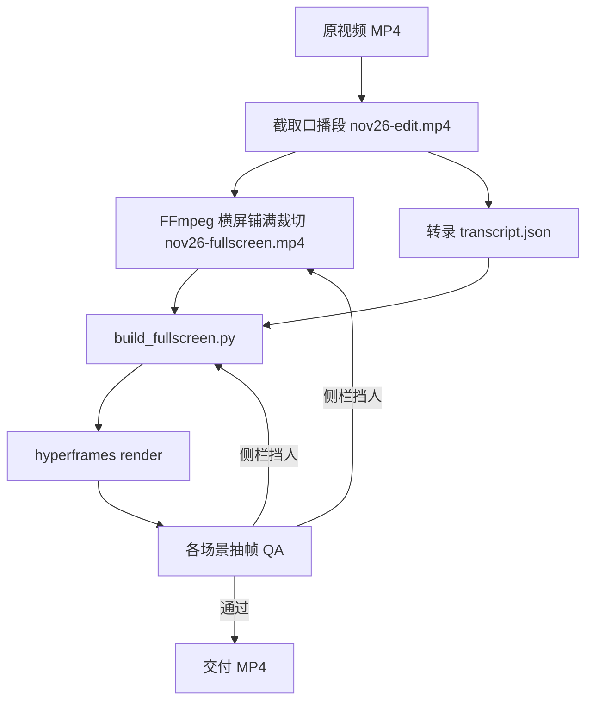

# 全屏横版口播视频生成工作流

> 基于 HyperFrames 的 **16:9 横屏全屏口播 + 左右侧栏动效** 成片流程。  
> 与《居左横版口播视频生成工作流》为 **并列的另一套工作流**，布局与素材处理完全不同。  
> 参考样板工程：`C:\hf_demo\projects\nov26-fullscreen`  
> 主构建脚本：`scripts/build_fullscreen.py`

---

## 0. 与「居左横版」的差异

| 维度 | 居左横版 | **全屏横版（本文）** |
|------|----------|----------------------|
| 口播视频 | 右侧 960px 槽位，紧裁头肩 | **铺满整屏** 1920×1080（`object-fit: cover`） |
| 动效位置 | 仅左侧 960px 面板 | **左 320px + 右 320px 侧栏**，中间留给人物 |
| 人物安全区 | 右半屏固定 | **中间约 1280px 禁止放任何 AI 图层** |
| 背景素材 | `nov26-face-clean.mp4`（紧裁） | `nov26-fullscreen.mp4`（横屏铺满裁切） |
| 数据来源标注 | 左面板左下角 | **左侧栏左下角**（有数据场景） |
| 构建脚本 | `build_landscape.py` | **`build_fullscreen.py`** |
| 工程目录 | `nov26-short` | **`nov26-fullscreen`** |

---

## 1. 产出规格

| 项 | 要求 |
|---|---|
| 画幅 | **1920×1080（16:9 横屏）** |
| 帧率 | 30 fps |
| 渲染引擎 | HyperFrames 真实渲染 |
| 口播层 | 全屏底层视频，可轻微慢推（scale 1.0→1.04） |
| 动效层 | 左右侧栏各 **320px**，渐变透明融入画面，**不遮挡中间人物** |
| 字幕 | 全宽居中，z-index 30，底部 150px 安全区 |

---

## 2. 布局结构

```
┌──────────────────────────────────────────────────────────────┐ 1920×1080
│ ░░左栏320px░░ │      中间人物安全区 1280px       │ ░░右栏320px░░ │
│  数据/标签     │   （口播视频全屏铺满，此处无 AI 图层）  │  数据/CTA   │
│  来源小字↙    │                                      │             │
├──────────────────────────────────────────────────────────────┤
│              全宽居中字幕 + 底部渐变（z-index 30）              │
└──────────────────────────────────────────────────────────────┘
         z-index 10 侧栏动效          z-index 1 全屏视频
```

**关键常量（`build_fullscreen.py`）：**

- `RAIL_W = 320` — 左右侧栏宽度  
- `SAFE_CENTER = W - 2 * RAIL_W` → **1280px** 人物保护区  
- `CAP_SAFE = 150` — 字幕与侧栏底部留白  

侧栏样式：半透明深色 + 向中心 **渐变透明**（`linear-gradient` 72% 处 fade out），避免硬切挡人。

---

## 3. 用户硬性要求（继承 + 全屏特化）

### 3.1 人物安全区（全屏专属）

- 中间 **1280px 区域不得出现** 文字、图表、色块、边框等 AI 元素。  
- 所有 scene composition 仅渲染 `.rail-left` / `.rail-right`，画布中心保持透明。  
- 设计动效前先确认口播者在画面中的位置，必要时调整 `object-position` 或 FFmpeg 裁切参数。

### 3.2 字幕（与居左工作流相同）

- 全宽水平居中，`z-index: 30`，底部渐变遮罩，不被侧栏或视频遮挡。

### 3.3 数据（与居左工作流相同）

- 数字必须真实可核实；含数据场景在 **左侧栏左下角** 标注来源（15–17px 等宽小字）。  
- 当前样板数据：Eurostat 欧盟自华进口 +6.4%、€519B→€559B；海关总署对欧 +3.0%、对美 +4.9%。

### 3.4 对比度（与居左工作流相同）

- 深底用 `#f2f6fb` / `#e0e8f2`，禁止 `#96a2b6` 或未设色的默认黑字。

### 3.5 动画（禁止静态 HTML）

- **每个 `fs-scene*.html` 必须有独立 GSAP timeline**，并注册到 `window.__timelines['场景id']`。
- **禁止** 使用 `scene_frame()` 一类静态模板（元素 CSS 直接 `opacity:1`，无时间轴）—— HyperFrames 会按帧采样，静态页等于「没有动画」。
- 动效结束态必须在 timeline 内完成（计数、stagger、clip-path、SVG 节点依次亮起等），**不能** 指望 CSS 初始态就是最终画面。

### 3.6 质量自检（必做，不可跳过）

- 渲染完成后 **必须** 用 `ffmpeg -ss` 在各场景结束时刻抽帧，**逐张目视**（或 Read 图片）后再交付。
- 重点检查：**横屏 1920×1080、侧栏动效是否播完、中间人物、字幕、来源、对比度**。

| 场景 | 结束时刻 | 检查点 |
|------|----------|--------|
| fs-scene1-hook | **5.60s**（场景 end 5.67） | 左标签滑入完成 / 右 +6.4% 计数 / 来源 Eurostat |
| fs-scene2-grid | **11.70s**（end 11.74） | 左 EU 条 / 右 CN+US 卡片 / 来源 |
| fs-scene3-flow | **18.45s**（end 18.5） | 左 SVG 流程 / 右 bullet / 中间清晰 |
| fs-scene4-stats | **22.75s**（end 22.8） | 左 +6.4% slam / 右 € 柱 / 来源 |
| fs-scene5-cta | **24.95s**（end 25.03） | 左右 CTA 分栏 / 无来源 |

---

## 4. 环境与目录

```
C:\hf_demo\
├── input\
│   ├── nov26.mp4
│   └── nov26-edit.mp4          # 口播切片（~25s）
└── projects\nov26-fullscreen\
    ├── assets\
    │   ├── transcript.json     # 可与 nov26-short 共用（build 时自动复制）
    │   └── nov26-fullscreen.mp4  # 横屏铺满裁切口播
    ├── compositions\           # build 生成（fs-scene*.html）
    ├── scripts\
    │   └── build_fullscreen.py
    ├── renders\
    ├── index.html
    └── meta.json
```

---

## 5. 端到端工作流



### Step 1 — 截取口播

```powershell
ffmpeg -y -i "C:\hf_demo\input\nov26.mp4" -t 25.033 -c copy "C:\hf_demo\input\nov26-edit.mp4"
```

### Step 2 — 生成全屏横屏口播底片

将竖屏/混合构图裁成 **1920×1080、DAR 16:9、SAR 1:1** 铺满：

```powershell
ffmpeg -y -i "C:\hf_demo\input\nov26-edit.mp4" `
  -vf "scale=1920:1080:force_original_aspect_ratio=increase,crop=1920:1080:(iw-1920)/2:(ih-1080)*0.58,setsar=1" `
  -c:v libx264 -r 30 -g 30 -keyint_min 30 -pix_fmt yuv420p -movflags +faststart -c:a aac -b:a 128k `
  "C:\hf_demo\projects\nov26-fullscreen\assets\nov26-fullscreen.mp4"
```

验证：`ffprobe` 应显示 `width=1920 height=1080 display_aspect_ratio=16:9`。

> **重要：** 不同原片人物位置不同，需预览后调整 `crop` 的 y 偏移（`0.58` 为起点）和 `index.html` 内 `object-position`。

### Step 3 — 构建工程（HyperFrames 标准 index）

`index.html` **必须**使用 HyperFrames 标准结构（与居左工作流相同）：

- `#root` + `data-width="1920"` + `data-height="1080"`
- 视频/音频带 `data-track-index`、`data-start`、`data-duration`
- 场景用 `data-composition-src` 嵌入，**禁止** fetch 动态加载（否则渲染会按竖屏 1080×1920 出片）

```powershell
python C:\hf_demo\projects\nov26-fullscreen\scripts\build_fullscreen.py
```

修改点：

- `DUR` / `SCENES` — 时间轴  
- `RAIL_W` — 侧栏宽度（人物较宽时可改为 360）  
- 各 `fs-scene*` 内容 — 左右分栏文案与动效  
- 数据常量区 — 换题时替换  

### Step 4 — 渲染

```powershell
Set-Location C:\hf_demo\projects\nov26-fullscreen
npx hyperframes render --quality standard --output renders\nov26-fullscreen-v3.mp4 --fps 30
ffprobe -v error -select_streams v:0 -show_entries stream=width,height,display_aspect_ratio -of default=nw=1 renders\nov26-fullscreen-v3.mp4
# 必须看到 width=1920 height=1080 display_aspect_ratio=16:9
Copy-Item renders\nov26-fullscreen-v3.mp4 "C:\Users\Administrator\Videos\" -Force
```

**当前交付：** `C:\Users\Administrator\Videos\nov26-fullscreen-v3.mp4`（2026-06-15，5 场景 GSAP 重写 + 抽帧 QA 通过）

| 版本 | 问题 |
|------|------|
| v1 | 非标准 index → 输出 **1080×1920 竖屏** |
| v2 | 横屏修复，但场景仍为 **静态 HTML，几乎无动画** |
| **v3** | 5 场景独立 GSAP timeline + 结束抽帧 QA |

### Step 5 — 抽帧 QA（交付前必跑）

```powershell
$v = "C:\hf_demo\projects\nov26-fullscreen\renders\nov26-fullscreen-v3.mp4"
$out = "C:\hf_demo\projects\nov26-fullscreen\renders\qa-v3"
New-Item -ItemType Directory -Force -Path $out | Out-Null
@(@("s1",5.60),@("s2",11.70),@("s3",18.45),@("s4",22.75),@("s5",24.95)) | ForEach-Object {
  ffmpeg -y -ss $_[1] -i $v -frames:v 1 -q:v 2 "$out\$($_[0]).png"
}
```

**QA 必查：**

- [ ] 口播是否全屏铺满  
- [ ] 中间人物是否被侧栏文字/色块遮挡  
- [ ] 左右侧栏内容是否「分栏」合理（非整屏大标题）  
- [ ] 字幕居中可读  
- [ ] 数据真实 + 左侧栏来源  

---

## 6. 场景分栏设计（样板）

| 场景 | 左栏（320px） | 右栏（320px） |
|------|---------------|---------------|
| fs-scene1-hook | 欧盟自华进口·2025同比 | **+6.4%** 计数 |
| fs-scene2-grid | 🇪🇺 自华进口 +6.4% | 🇨🇳 对欧 +3.0% / 🇺🇸 对美 +4.9% |
| fs-scene3-flow | 垂直迷你流程图 | 增速摘要行 |
| fs-scene4-stats | **+6.4%** | €519B → €559B 柱 |
| fs-scene5-cta | 欧洲各国 | **开始行动** |

CTA 场景无数据、无来源行。

---

## 7. 新项目复制

1. 复制 `C:\hf_demo\projects\nov26-fullscreen` → 新工程名  
2. 替换 `assets/nov26-fullscreen.mp4` + 调整 FFmpeg 裁切  
3. 更新 `transcript.json`、数据常量、场景文案  
4. `build_fullscreen.py` → render → 抽帧 QA  
5. **禁止** 直接复用 `build_landscape.py` 的整屏左面板场景 HTML  

---

## 8. 命令速查

```powershell
python C:\hf_demo\projects\nov26-fullscreen\scripts\build_fullscreen.py
Set-Location C:\hf_demo\projects\nov26-fullscreen
npx hyperframes render --quality standard --output renders\nov26-fullscreen-v3.mp4 --fps 30
```

---

## 9. 相关文档

- 《居左横版口播视频生成工作流》— 左动效 + 右口播分屏方案  
- 工程快捷引用：`C:\hf_demo\projects\nov26-fullscreen\docs\全屏横版口播视频生成工作流.md`

---

*v3 修订：2026-06-15 — 5 场景 GSAP 全重写；禁止静态 scene；抽帧 QA 写入流程。*
