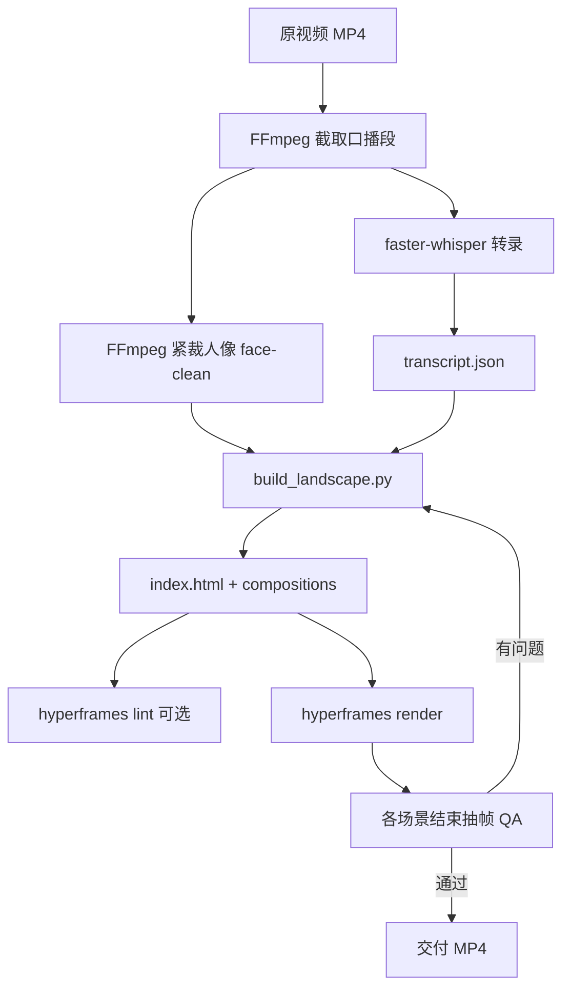

# 居左横版口播视频生成工作流

> 基于 HyperFrames 的 **16:9 横屏口播 + 左侧动效** 成片流程。  
> 参考样板工程：`C:\hf_demo\projects\nov26-short`  
> 主构建脚本：`scripts/build_landscape.py`  
> 最新成片：`nov26-landscape-v5.mp4`

---

## 1. 产出规格

| 项 | 要求 |
|---|---|
| 画幅 | **1920×1080（16:9 横屏）** |
| 帧率 | 30 fps |
| 渲染引擎 | **HyperFrames 真实渲染**（非 FFmpeg 兜底合成） |
| 时长 | 按口播切片（样板约 25s，可改 `DUR`） |
| 布局 | 左 960px 动效区 + 右 960px 口播区，中间分割线 |
| 音频 | 口播原声（与 face 视频同源） |

---

## 2. 用户硬性要求（必须遵守）

### 2.1 字幕

- **全宽水平居中**（`left:0; right:0`），不得偏左/偏右。
- **z-index 最高**（`captions-layer` ≥ 30），不得被动效或口播遮挡。
- 底部 **渐变遮罩**（`cap-backdrop`）保证在浅色西装/亮背景上仍可读。
- 动效面板预留 **150px 字幕安全区**（`CAP_SAFE` + `padding-bottom`）， ticker 等元素不得侵入底部。

### 2.2 数据标注

- 凡出现 **数字、百分比、图表、对比条** 的场景，数据必须 **真实、可核实**。
- **禁止** 虚构的「100%」「2×」「72%/88%」等装饰性假数据。
- 每个含数据场景在 **左侧面板左下角** 显示简短来源（17px 等宽小字），例如：
  - `来源：Eurostat，2025-04`
  - `来源：海关总署，2024`
  - `来源：Eurostat / 海关总署`
- 口播中的夸张表述（如「几乎成倍增长」）与官方统计不一致时，**画面用官方同比/进口额**，口播保留原话。

### 2.3 文字对比度

- 深色底（`#07121c` 等）上 **禁止** 深灰字（如 `#96a2b6`）或未设 `color` 的默认黑字。
- 统一色板：
  - 主文案 `TEXT_BODY = #f2f6fb`
  - 次要标签 `TEXT_MUTED = #e0e8f2`
  - 强调 `TEXT_ACCENT = #37bdf8`
  - 警示/数值 `TEXT_WARN = #f09025`
- SVG 节点内文字在深蓝框上优先用 **白色**，不用低对比青色。

### 2.4 动效与口播

- 口播视频 **锁定右侧 `#face-slot`**，不得侵入左侧动效区。
- 使用 **紧裁人像**（头肩），去掉新闻台标、德文字幕等 UI；推荐 `nov26-face-clean.mp4`。
- 动效需 **多场景 GSAP 时间轴**，非简单标题卡；每场景独立 composition + `window.__timelines`。

### 2.5 流程图 / SVG

- 节点与连线必须在 **同一 SVG 坐标系** 内绘制（`<g>` + `<path>`），禁止 HTML 绝对定位节点 + SVG 路径混用导致错位。

### 2.6 质量自检

- **每个场景动画结束后抽帧** 目视检查（布局、字幕、数据、对比度、连线对齐）。
- 样板抽帧时刻（25s 片）：

| 场景 | 结束时刻 | 检查点 |
|------|----------|--------|
| scene1-hook | ~5.37s | +6.4%、来源、字幕 |
| scene2-grid | ~11.44s | 三项同比、国家名可读、来源 |
| scene3-flow | ~18.2s | 流程图对齐、图例、来源 |
| scene4-stats | ~22.5s | €519B/€559B、+6.4%、来源 |
| scene5-cta | ~24.73s | CTA 文案、字幕 |

---

## 3. 环境与目录

### 3.1 依赖

- Node.js v22+、`npx hyperframes`（样板 0.6.99）
- FFmpeg（切片、紧裁、抽帧 QA）
- Python 3 + `faster-whisper`（转录，生成 `transcript.json`）

### 3.2 推荐目录（路径勿含空格/中文）

```
C:\hf_demo\
├── student-kit\              # nateherkai/hyperframes-student-kit
├── input\
│   ├── nov26.mp4             # 原片
│   └── nov26-edit.mp4        # 截取口播段（如前 25s）
└── projects\nov26-short\     # HyperFrames 工程
    ├── assets\
    │   ├── transcript.json
    │   └── nov26-face-clean.mp4
    ├── compositions\         # 由 build 脚本生成
    ├── scripts\
    │   ├── build_landscape.py
    │   └── transcribe.py
    ├── renders\
    └── index.html
```

### 3.3 成片输出

- 工程内：`renders\nov26-landscape-vN.mp4`
- 交付：`C:\Users\Administrator\Videos\nov26-landscape-vN.mp4`

---

## 4. 端到端工作流



### Step 1 — 准备口播素材

```powershell
# 截取前 N 秒（按实际需要）
ffmpeg -y -i "C:\hf_demo\input\nov26.mp4" -t 25.033 -c copy "C:\hf_demo\input\nov26-edit.mp4"

# 紧裁上半屏主播头肩（参数按原片微调）
ffmpeg -y -i "C:\hf_demo\input\nov26-edit.mp4" -vf "crop=460:520:310:115,scale=1080:1080" -c:v libx264 -r 30 -g 30 -keyint_min 30 -movflags +faststart -c:a copy "C:\hf_demo\projects\nov26-short\assets\nov26-face-clean.mp4"
```

> 若口播者在画面下半屏，需改 `crop=` 参数（曾测试 `crop=540:640:120:1080` 等）。

### Step 2 — 转录

```powershell
python C:\hf_demo\projects\nov26-short\scripts\transcribe.py
# 产出 assets/transcript.json（词级时间戳）
```

### Step 3 — 构建 HyperFrames 工程

```powershell
python C:\hf_demo\projects\nov26-short\scripts\build_landscape.py
# 产出 index.html、compositions/*.html、meta.json
```

**在 `build_landscape.py` 中修改：**

- `DUR` — 总时长（与切片一致）
- `SCENES` — 各场景起止时间（与 transcript 语义对齐）
- 数据常量区（`EU_IMP_CN_*`、`CN_EXP_*`、`SRC_*`）— 换题时替换为新的真实数据与来源
- 各 scene 的 HTML/GSAP — 动效内容与口播主题一致

### Step 4 — 渲染

```powershell
Set-Location C:\hf_demo\projects\nov26-short
npx hyperframes render --quality standard --output renders\nov26-landscape-v5.mp4 --fps 30
```

可选检查：

```powershell
npx hyperframes lint --verbose
```

### Step 5 — 抽帧 QA

```powershell
$v = "C:\hf_demo\projects\nov26-short\renders\nov26-landscape-v5.mp4"
$out = "C:\hf_demo\projects\nov26-short\renders\qa"
New-Item -ItemType Directory -Force -Path $out | Out-Null
@(
  @{t=5.37; n="scene1-end"},
  @{t=11.44; n="scene2-end"},
  @{t=18.2; n="scene3-end"},
  @{t=22.5; n="scene4-end"},
  @{t=24.73; n="scene5-end"}
) | ForEach-Object {
  ffmpeg -y -ss $_.t -i $v -frames:v 1 -q:v 2 "$out\$($_.n).jpg"
}
Copy-Item $v "C:\Users\Administrator\Videos\nov26-landscape-v5.mp4" -Force
```

**QA 清单：**

- [ ] 字幕居中、未被挡、浅色背景上可读  
- [ ] 数据与来源一致、无假数  
- [ ] 左下角来源小字可见  
- [ ] 无深底深字  
- [ ] 口播未压左侧动效  
- [ ] SVG 流程图连线对齐  

---

## 5. 布局结构（index.html）

```
┌──────────────────────────────────────────────────────────┐ 1920×1080
│ ambient-bg (全画布背景)                                   │
├──────────────────────┬───────────────────────────────────┤
│ 左 960px 动效区       │ 右 960px #face-slot               │
│ scene1~5 按时间切换   │ nov26-face-clean.mp4              │
│ padding-bottom 150px │ overflow:hidden                   │
├──────────────────────┴───────────────────────────────────┤
│ 全宽字幕层 z-index:30 + cap-backdrop                      │
└──────────────────────────────────────────────────────────┘
```

关键 CSS 常量（`build_landscape.py`）：

- `W, H = 1920, 1080`
- `PANEL_W = 960`
- `CAP_SAFE = 150`
- `#captions-layer { z-index: 30 }`

---

## 6. 场景模板（样板 5 段）

| 场景 ID | 时间 | 内容 | 数据 |
|---------|------|------|------|
| scene1-hook | 0 – 5.67s | 欧盟自华进口 +6.4% 计数动画 | Eurostat |
| scene2-grid | 5.67 – 11.74s | 三项出口/进口同比增速对比条 | Eurostat + 海关总署 |
| scene3-flow | 11.74 – 18.5s | 贸易战→供应链 SVG 流程图 + 增速摘要 | 混合来源 |
| scene4-stats | 18.5 – 22.8s | €519B → €559B 柱状 + +6.4% | Eurostat |
| scene5-cta | 22.8 – 25.033s | CTA 文案（无数据、无来源） | — |

换题时：保持 **5 段结构 + 时间轴对齐 transcript**，替换文案与数据常量即可。

---

## 7. 当前样板真实数据（v5）

| 指标 | 数值 | 来源 |
|------|------|------|
| 欧盟自华进口 2024 | €5190 亿 | Eurostat |
| 欧盟自华进口 2025 | €5590 亿 | Eurostat |
| 2025 同比 | +6.4% | Eurostat 2025-04 新闻稿 |
| 中国对欧出口 2024 同比 | +3.0% | 海关总署（美元计全年） |
| 对美出口 2024 同比 | +4.9% | 海关总署 |

---

## 8. 新项目快速复制

1. 复制 `C:\hf_demo\projects\nov26-short` → `projects\<新项目名>`
2. 替换 `assets/` 下视频与 `transcript.json`
3. 修改 `build_landscape.py` 中 `DUR`、`SCENES`、数据常量、场景文案
4. 运行 build → render → 抽帧 QA
5. 版本号递增：`nov26-landscape-vN.mp4`

---

## 9. 已知问题与规避

| 问题 | 处理 |
|------|------|
| 路径含空格/中文导致 `hyperframes init` 失败 | 工程放在 `C:\hf_demo\` 等纯英文路径 |
| face 视频 keyframe 稀疏导致 seek 卡顿 | 重编码 `-g 30 -keyint_min 30` |
| Google Fonts 离线渲染警告 | 可后续改为本地 `@font-face` |
| FrameCraft 主项目 HyperFrames 未安装会 FFmpeg 兜底 | 独立实验用 `C:\hf_demo`；主项目需安装 `node_modules/hyperframes` |

---

## 10. 命令速查

```powershell
# 一键：构建 + 渲染
python C:\hf_demo\projects\nov26-short\scripts\build_landscape.py
Set-Location C:\hf_demo\projects\nov26-short
npx hyperframes render --quality standard --output renders\nov26-landscape-v5.mp4 --fps 30
```

---

## 11. 修订记录

| 版本 | 日期 | 说明 |
|------|------|------|
| v1–v2 | 2026-06 | 16:9 布局、口播右栏、紧裁人像 |
| v3 | 2026-06 | 字幕居中、scene3 SVG 统一坐标、场景抽帧 QA |
| v4 | 2026-06 | 文字对比度修复（深底禁深字） |
| v5 | 2026-06 | 真实数据 + 左下角来源标注 |

---

## 12. 相关工作流

- **《全屏横版口播视频生成工作流》** — 口播铺满整屏，动效分置左右 320px 侧栏，中间 1280px 留给人物；工程 `nov26-fullscreen`，脚本 `build_fullscreen.py`。

---

*本文档与 `build_landscape.py` 同步维护；改脚本逻辑时请一并更新本节。*
